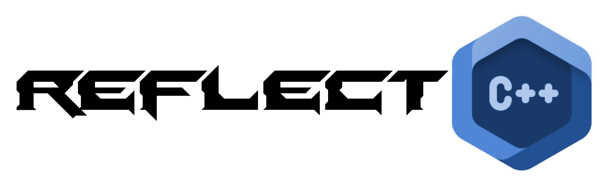

  

A small and simple C++ Reflection Library

## Requirements
- C++17 Compiler
- Include the ReflectCPP.h anywhere you want to use it
- Compile and link the ReflectCPP.cpp Translation Unit
- No external Libraries needed!
- Everything is pure C++
